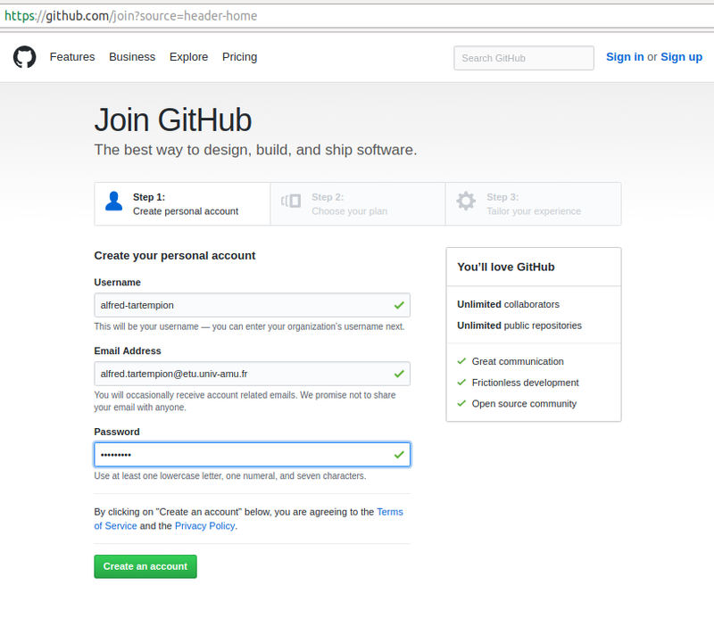
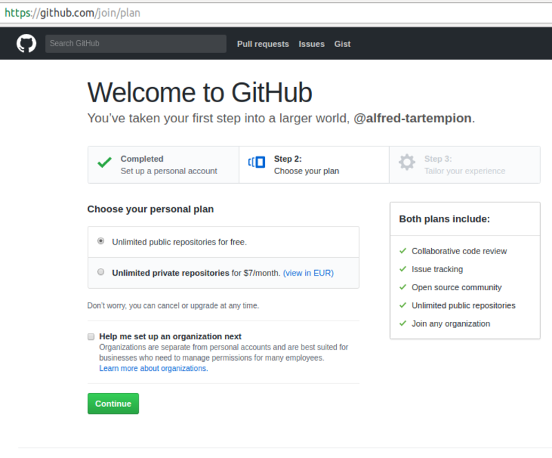
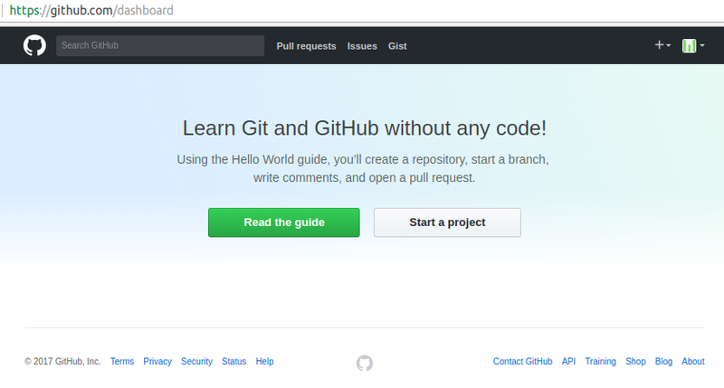
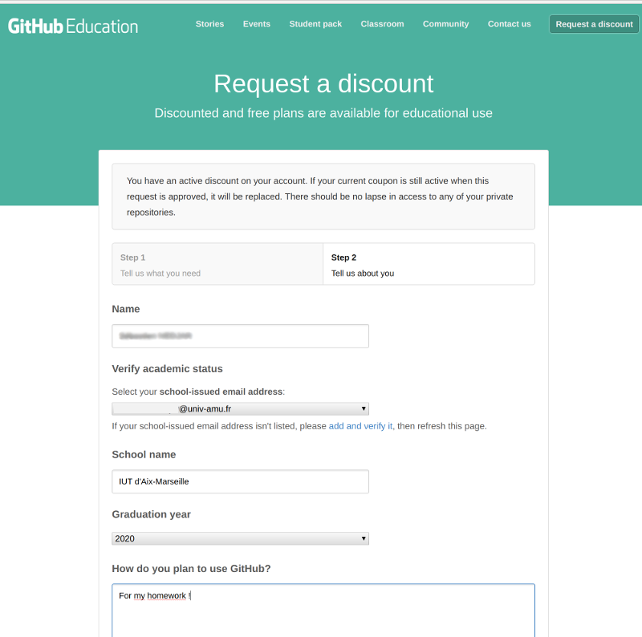

#  Artisanat logiciel et qualité de développement

### IUT d’Aix-Marseille – Département Informatique Aix-en-Provence

* **Ressource:** [R2.03](https://cache.media.enseignementsup-recherche.gouv.fr/file/SPE4-MESRI-17-6-2021/35/5/Annexe_17_INFO_BUT_annee_1_1411355.pdf)
* **Responsable:** [Sébastien NEDJAR](mailto:sebastien.nedjar@univ-amu.fr)
* **Besoin d'aide ?**
    * Consulter et/ou créér des [issues](https://github.com/IUTInfoAix-R203/tp1-git/issues).
    * [Email](mailto:sebastien.nedjar@univ-amu.fr) pour une question d'ordre privée, ou pour convenir d'un rendez-vous physique.

## Aperçu du TP et objectifs d'apprentissage

L'objectif de ce TP est de vous donner une brève introduction à git et à GitHub. Vous aurez accès également à du matériel plus approfondi et quelques idées pour vous aider à démarrer.

Ce TP est une libre adaptation du [Github Starter Course](https://github.com/education/github-starter-course).

## TP 1 : Découverte de l'environnement de travail, des outils et premiers pas avec git

L'objectif premier de ce TP est de vous familiariser avec tous les nouveaux outils qui seront mis en oeuvre pendant cet enseignement. 

En plus de la découverte des bases de l'artisanat logiciel, les TP seront la première occasion de se confronter à la gestion de version, au test unitaire et à des outils de gestion de cycle de vie.

### Préparation de l'environnement

Comme vous allez le découvrir (a priori surtout l'approfondir), pour conserver vos réalisations et permettre à votre enseignant de suivre votre avancement vous allez apprendre à versionner votre travail sur [github](https://github.com/). Pendant ce module, vous allez principalement écrire du code pour vous-même. Comme vous le verrez plus tard ça sera principalement sur les SAÉ que [Git](https://git-scm.com/) offrira tout son potentiel.

#### Création d'un compte Github

Rendez-vous sur la page d'accueil de [github](https://github.com/) :


Dans le coin supérieur droit cliquer sur "Sign Up". Dans la page qui apparaît, inscrivez votre nom d'utilisateur (**il doit être impérativement composé de votre prénom et de votre nom séparé par le caractère '-'**). 
Dans le champs "Email Adress" mettre votre adresse universitaire (important pour bénéficier des avantages liés à votre statut d'étudiant). 



Une fois le mot de passe renseigné cliquer sur le bouton "Create Account". Sur l'écran suivant, vous n'avez rien à changer et pouvez directement cliquer sur "Continue".



Le troisième et dernier écran d'enregistrement vous demande des informations sur votre profil. Indiquer principalement que vous êtes un étudiant et que vous comptez utiliser GitHub pour des projets étudiants.


Une fois ces informations renseignées vous pouvez cliquer sur "Submit" pour définitivement créer votre compte.



Ne pas oublier de valider votre adresse email en allant cliquer sur le lien reçu dans l'ENT.

#### Paramétrage de votre compte GitHub

Maintenant que votre compte est créé, il faut personnaliser votre profil. GitHub, en plus de vous fournir un moyen simple et efficace de conserver votre code en ligne, est aussi un réseau social de développeur. Pour que votre profil puisse être valorisé un jour dans votre carrière pro, vous devez correctement renseigner vos informations (de manière annexe, ça facilitera la vie de vos enseignants quand ils essayent de savoir qui contribue vraiment dans les SAÉ).

Pour ce faire, cliquer en haut à droite de la fenêtre sur l’icône qui représente votre avatar par défaut et aller sur "Your profile"  :


Vous arrivez sur votre profil public (ce qui est visible quand on cherche votre nom) :


Cliquer sur le bouton "Edit profile" pour arriver sur le formulaire suivant :


Comme dans l'image précédente, renseignez correctement votre nom, prénom, votre localisation et éventuellement votre photo.

#### Demande du "Student Pack"

Pour terminer la configuration de votre compte, il vous faut demander la remise académique vous permettant de bénéficier de dépôts privés et de nombreux autres avantages. Pour ce faire, il faut vous rendre sur la page suivante : https://education.github.com/pack


Cliquer sur le bouton "Get your pack" et certifiez que vous êtes bien un étudiant de plus de 13 ans : 


Vérifiez les informations vous concernant (Nom, Email et École principalement)



Validez le formulaire pour terminer cette demande. Généralement la validation de la demande intervient dans l'heure mais il peut arriver que ça puisse prendre plus de temps donc pas d'inquiétude.
 


#### Configuration locale de Git

Pour commencer avec Git, nous utilisons directement la version en ligne de commande. Comme vous les verrez rapidement, il existe une  pléthore d'outils pour faciliter l'utilisation de Git mais pour s'en servir, il vaut mieux comprendre les commandes sous-jacentes.

La première chose à faire avant d'utiliser Git est de correctement le configurer. Cette étape en pratique peut prendre du temps mais nous allons simplifier la chose en téléchargeant deux fichiers : 

```sh
wget https://raw.githubusercontent.com/IUTInfoAix-M2105/git_config/master/gitconfig -O ~/.gitconfig
wget https://raw.githubusercontent.com/IUTInfoAix-M2105/git_config/master/githelpers -O ~/.githelpers
```

Ouvrez le fichier `~/.gitconfig` avec votre éditeur favori et renseignez votre nom, prénom et email dans la 
section `[user]`.
```
# Personnalisez les champs ci-dessous!
[user]
username = ChangeMe
name = Change Me
email = change-me@example.com

...

```
Les lignes précédentes doivent donc être modifiées de la sorte :

```
# Personnalisez les champs ci-dessous!
[user]
username = alfred-tartempion
name = Alfred Tartempion
email = alfred.tartempion@etu.univ-amu.fr

...

```

#### Visualiser la branche courante

Histoire de visualiser plus facilement sur quelle branche vous êtes, si vous avez le malheur d'utiliser bash, modifiez votre prompt de votre terminal afin qu'il affiche la branche courante.

Éditez le fichier `~/.bash_profile` et ajoutez les lignes suivantes:

```sh
parse_git_dirty (){
  [[ $(git status 2> /dev/null | tail -n1) != "rien à valider, la copie de travail est propre" ]] && echo "*"
}

parse_git_branch () {
  git branch --no-color 2> /dev/null | sed -e '/^[^*]/d' -e "s/^..\(.*\)/(\1$(parse_git_dirty))/"
}

# Prompt simple pour afficher la branche git courante
PS1="\[\033[01;34m\]\w\[\033[00m\]" 
PS1="$PS1 \[\033[01;31m\]\$(parse_git_branch)\[\033[00m\]"
PS1="$PS1\$ "
```

Tapez `source ~/.bash_profile` pour charger la nouvelle configuration. Votre prompt devrait ressembler à cela:

```sh
~/helloworld (master)$
```

S'il y a des modifications pas encore versionnées, le nom de la branche courante sera suivi du caractère `*`.

### Première prise de contact avec Git

Pour continuer à prendre en main Git et GitHub, vous allez suivre un tutoriel interactif vous permettant de découvrir l'une après l'autre, les possibilités de cet outil.

Le tutoriel s'appelle **Learning Git Branching**, il fonctionne directement dans le navigateur. Pour commencer, allez à l'adresse : 

[https://learngitbranching.js.org/](https://learngitbranching.js.org/?locale=fr_FR)

Essayez de valider autant d'étape que possible en prenant bien le temps de comprendre ce que vous faites à chaque étape. Si certaines notion vous parraissent difficiles, n'hésitez pas à questionner votre enseignant au fur et à mesure.

Une fois le tutoriel terminé, prennez une capture d'écran de la page web intégrant toutes les étapes que vous avez réalisées et l'envoyer à votre enseignant.

### :wave : Les bases de GitHub 
#### :octocat : Git et GitHub

Git est un **système de gestion de version distribué (VCS)**, ce qui signifie qu'il s'agit d'un outil utile pour suivre facilement les modifications apportées à votre code, collaborer et partager. Avec Git, vous pouvez suivre les modifications que vous apportez à votre projet afin d'avoir toujours une trace de ce sur quoi vous avez travaillé et de pouvoir facilement revenir à une version plus ancienne si nécessaire. Cela facilite également le travail avec les autres : des groupes de personnes peuvent travailler ensemble sur le même projet et fusionner leurs modifications en un seul emplacement.

GitHub est un moyen d'utiliser la puissance de Git en ligne avec une interface web facile à prendre en main. Il est utilisé dans le monde du logiciel et au-delà pour collaborer et maintenir l'historique des projets.

GitHub abrite certaines des projets les plus importants. Que vous visualisiez des données ou que vous créiez un nouveau jeu, il existe toute une communauté et un ensemble d'outils sur GitHub qui peuvent vous faire permettre d'aller plus loin.

#### :octocat : Comprendre le GitHub flow

Le GitHub flow est un flux de travail léger qui vous permet d'expérimenter et de collaborer facilement sur vos projets, sans risquer de perdre votre travail précédent. Il permet d'avoir une convention méthodologique uniforme est bien connue de tous pour travailler sur un projet collaboratif sans passer trop de temps sur la définition des détails organisationnels avant de commencer à produire du code. Dans le module, sauf s'il y a une mention explicite, le Github Flow sera notre flux de travail par défaut.

#### Le Dépot
Un dépot (aussi appelé référenciel parfois) est l'endroit où le travail de votre projet se déroule - considérez-le comme le dossier de votre projet. Il contient tous les fichiers de votre projet et l'historique des révisions. Vous pouvez travailler seul dans un dépot ou inviter d'autres personnes à collaborer avec vous sur ces fichiers.

#### Clonage

Lorsqu'un dépot est créé avec GitHub, il est stocké à distance. Vous pouvez cloner un référentiel pour créer une copie locale sur votre ordinateur, puis utiliser Git pour synchroniser les deux. Cela facilite la résolution des problèmes, l'ajout ou la suppression de fichiers et la diffusion de commits plus importants. Vous pouvez également utiliser l'outil d'édition de votre choix pour faire vos modifications. Le clonage extrait également toutes les données du dépot dont dispose GitHub( c'est à dire toutes les versions de chaque fichier et dossier du projet). Cela peut être utile si vous expérimentez votre projet et réalisez ensuite que vous avez davantage besoin d'une version précédente.

Pour en savoir plus sur le clonage, lisez ["Cloning a Repository"](https://docs.github.com/en/github/creating-cloning-and-archiving-repositories/cloning-a-repository).

#### Commiter et pousser
**commit** et **push** sont les deux actions qui vous permettent d'ajouter les modifications que vous avez apportées sur votre ordinateur local au dépot distant hebergé par GitHub. De cette façon, votre enseignant et/ou vos coéquipiers peuvent voir votre travail lorsque vous êtes prêt à le partager. Vous pouvez effectuer un commit lorsque vous avez apporté des modifications à votre projet et que vous souhaitez créer un "point d'étape". Vous pouvez également ajouter un **message de validation** utile pour vous rappeler ou rappeler à vos coéquipiers le travail que vous venez d'effectuer (par exemple, "Ajout d'un fichier README contenant des informations sur notre projet").

Une fois que vous avez un ou plusieurs commits et que vous êtes prêt à les ajouter au référentiel distant, vous pouvez utiliser la commande push pour ajouter ces modifications. Commiter et pousser peut sembler nouveau au début, mais vous vous y habituerez rapidement et ne pourrez plus vous en passer 🙂.

### 💻 Termes GitHub à connaître

#### Dépots
Nous avons déjà mentionné les dépots/référentiels, ils sont l'endroit où le travail de votre projet se déroule. Au fur et à mesure que vous travaillez sur GitHub, vous aller créer de nombreux dépots. Heureusement, votre ["tableau de bord GitHub"](https://docs.github.com/en/github/setting-up-and-managing-your-github-user-account/about-your-personal-dashboard) aide à accéder directement à vos dépots et consulter des informations utiles. Assurez-vous d'être connecté pour voir votre tableau de bord.

Les référentiels contiennent également des fichiers appelés **README**. Vous pouvez ajouter un fichier README à votre dépot pour dire aux autres personnes pourquoi votre projet est utile, ce qu'ils peuvent faire avec et comment ils peuvent l'utiliser. Nous utilisons le README pour vous expliquer comment apprendre Git et GitHub.

Pour en savoir plus sur les référentiels, lisez ["Creating, Cloning, and Archiving Repositories](https://docs.github.com/en/github/creating-cloning-and-archiving-repositories/about-repositories) et ["About README's "](https://docs.github.com/en/github/creating-cloning-and-archiving-repositories/about-readmes).

#### Les Branches
Vous pouvez utiliser des branches sur GitHub pour isoler le travail que vous ne souhaitez pas encore fusionner dans votre projet final. Les branches vous permettent de développer des fonctionnalités, de corriger des bogues ou d'expérimenter en toute sécurité de nouvelles idées dans une zone confinée de votre dépot. En règle générale, vous pouvez créer une nouvelle branche à partir de la branche par défaut de votre référentiel — appelée généralement `main`. Cela crée une nouvelle copie de travail de votre référentiel pour que vous puissiez expérimenter. Une fois que vos nouvelles modifications ont été examinées par un coéquipier, ou si vous en êtes satisfait, vous pouvez fusionner vos modifications dans la branche par défaut de votre dépot.

Pour en savoir plus sur la création de branches, lisez ["About branches"](https://docs.github.com/en/github/collaborating-with-issues-and-pull-requests/about-branches).

#### Les Forks
Un fork est un autre moyen de copier un dépot dans GitHub. Il est généralement utilisé lorsque vous souhaitez contribuer à un projet qui ne vous appartient pas. Créer un fork permet d'expérimenter librement des modifications sans affecter le projet d'origine. C'est une approche très populaire lorsque vous souhaitez contribuer à des projets de logiciels open source !

Pour en savoir plus sur le fork, lisez ["Fork a repo"](https://docs.github.com/en/github/getting-started-with-github/fork-a-repo).

#### Demandes d'extraction ou Pull Request
Lorsque vous travaillez avec des branches, vous pouvez utiliser une pull request pour informer les autres des contributions que vous souhaitez apporter et leur demander leur avis. Une fois qu'une pull request est ouverte, vous pouvez discuter et passer en revue les modifications potentielles avec les collaborateurs et ajouter d'autres modifications si nécessaire. Vous pouvez ajouter des personnes spécifiques en tant que relecteur/évaluateur de votre demande d'extraction, ce qui montre que vous souhaitez obtenir leurs commentaires sur vos modifications ! Une fois qu'une pull request est prête, elle peut être fusionnée dans la branche principale.

Pour en savoir plus sur les demandes d'extraction, lisez ["About Pull Requests"](https://docs.github.com/en/github/collaborating-with-issues-and-pull-requests/about-pull-requests).

#### Les issues
Les **issues** sont un moyen de suivre les améliorations, les tâches ou les bogues d'un projet sur GitHub. Les *issues* sont un excellent moyen de garder une trace de toutes les tâches sur lesquelles vous souhaitez travailler pour votre projet et de faire savoir aux autres ce sur quoi vous prévoyez de travailler. Vous pouvez également utiliser des *issues* pour informer un projet open source d'un bogue que vous avez trouvé ou d'une fonctionnalité qu'il serait bon d'ajouter !

Pour les projets plus importants, vous pouvez suivre de nombreuses *issues* sur un tableau de type Kanban. Les projets GitHub vous aident à organiser et à hiérarchiser votre travail et vous pouvez en savoir plus à leur sujet dans ce document ["About managing your work on Github"](https://docs.github.com/en/github/managing-your-work-on-github/).

Vous n'aurez probablement pas besoin d'un tableau de projet pour vos projets scolaires, mais une fois que vous passerez à des projets plus importants, ils constituent un excellent moyen d'organiser le travail de votre équipe !

Vous pouvez également lier les demandes d'extraction (PR) et les *issues* pour montrer qu'un correctif est en cours et pour fermer automatiquement l'*issue* lorsque quelqu'un fusionne la Pull Request.

Pour en savoir plus sur le lien entre les *issuesù et Pull-Request, lisez ["About Issues"](https://docs.github.com/en/github/managing-your-work-on-github/about-issues).

#### Utiliser Markdown sur GitHub

Vous l'avez peut-être déjà remarqué, mais vous pouvez ajouter un formatage à vos issues, demandes d'extraction et fichiers. Le langage ["Markdown"](https://guides.github.com/features/mastering-markdown/) est un moyen simple de formater vos issues, demandes d'extraction et fichiers avec une syntaxe simple. Cela peut être utile pour organiser vos informations et en faciliter la lecture pour les autres. Vous pouvez également déposer des gifs et des images pour aider à transmettre votre point de vue !

Pour en savoir plus sur l'utilisation de Markdown de GitHub, lisez ["Basic Writing and Formatting Syntax"](https://docs.github.com/en/github/writing-on-github/basic-writing-and-formatting-syntax).

### Création de votre fork du TP1
Maintenant que vous connaissez les bases de Git, vous allez pouvoir commencer à travailler sur vos TP. Comme vous allez le découvrir le rendu, l'évaluation et le suivi de votre travail passeront par GitHub. La première chose que vous allez donc faire est de créer un fork d'un dépôt. Pour ce faire, rendez-vous sur le lien suivant :

https://classroom.github.com/a/nf6u9v4U

GitHub va vous créer un dépôt contenant un fork de ce dépôt. Vous apparaîtrez automatiquement comme contributeur de ce projet pour y pousser votre travail. Sachez qu'un robot récupérera automatiquement votre code après chaque push pour vérifier que les tests passent et calculer en même temps votre taux d'accomplissement du TP.

#### À faire à la fin de chaque exercice (et probablement plus) 
Une fois qu'un exercice sera terminé, n'oubliez pas de pousser vos modifications sur votre fork de la manière suivante :
```sh
~/tpR203/tp1-VotreUsername (main*)$ git add .
~/tpR203/tp1-VotreUsername (main*)$ git commit -m "Validation de l'exercice XX"
~/tpR203/tp1-VotreUsername (main)$ git push origin main
```

### 📝 Travail à faire

1. Ouvrez une pull request et faites savoir à votre professeur que vous avez terminé de lire le TP.  

2. Créez un nouveau fichier Markdown dans le dépot. Ecrivez une dizaine de ligne sur ce que vous avez appris et ce qui vous rend encore confus. Expérimentez avec différentes mise en forme pour rendre votre document le plus explicite possible.

3. Créez le README de profil. Faites en sorte que le monde en sache un peu plus sur vous ! Qu'est-ce qui vous intéresse d'apprendre ? Sur quoi vous travaillez? Quel est votre passe-temps favori ? 

    En savoir plus sur la création de votre README profil dans le document ["Managing Your Profile README"](https://docs.github.com/en/account-and-profile/setting-up-and-managing-your-github-profile/customizing-your-profile/managing-your-profile-readme).

4. Accédez à votre tableau de bord utilisateur et créez un nouveau dépot. Testez les fonctionnalités de ce référentiel pour vous familiariser avec elles.

### 📚 Ressources
* [Une courte vidéo expliquant ce qu'est GitHub](https://www.youtube.com/watch?v=w3jLJU7DT5E&feature=youtu.be)
* [Ressources d'apprentissage Git et GitHub](https://docs.github.com/en/github/getting-started-with-github/git-and-github-learning-resources)
* [Comprendre le flux GitHub](https://guides.github.com/introduction/flow/)
* [Comment utiliser les branches GitHub](https://www.youtube.com/watch?v=H5GJfcp3p4Q&feature=youtu.be)
* [Matériel de formation Git interactif](https://githubtraining.github.io/training-manual/#/01_getting_ready_for_class)
* [Laboratoire d'apprentissage de GitHub](https://lab.github.com/)
* [Forum de la communauté de l'éducation](https://education.github.community/)
* [Forum de la communauté GitHub](https://github.community/)