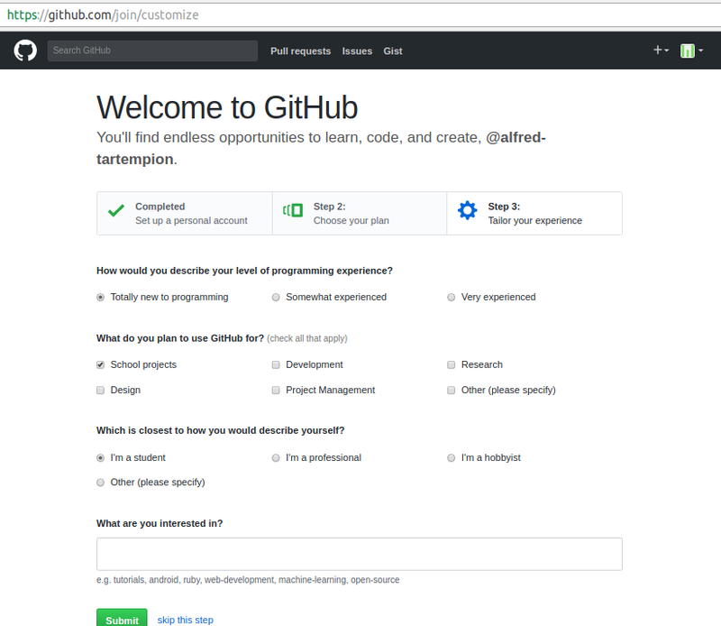
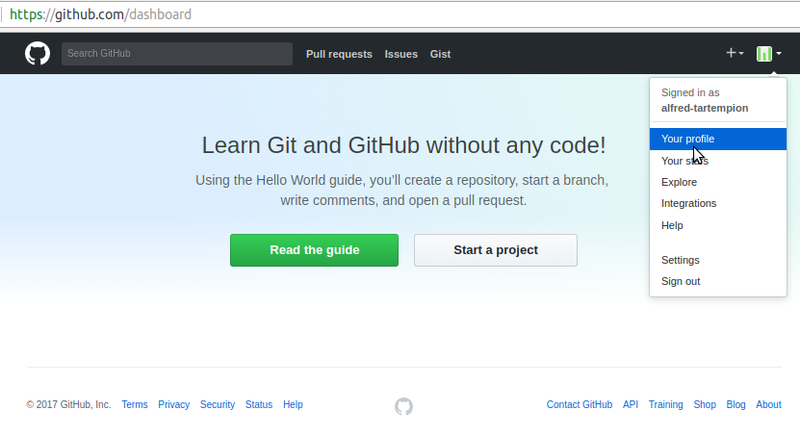
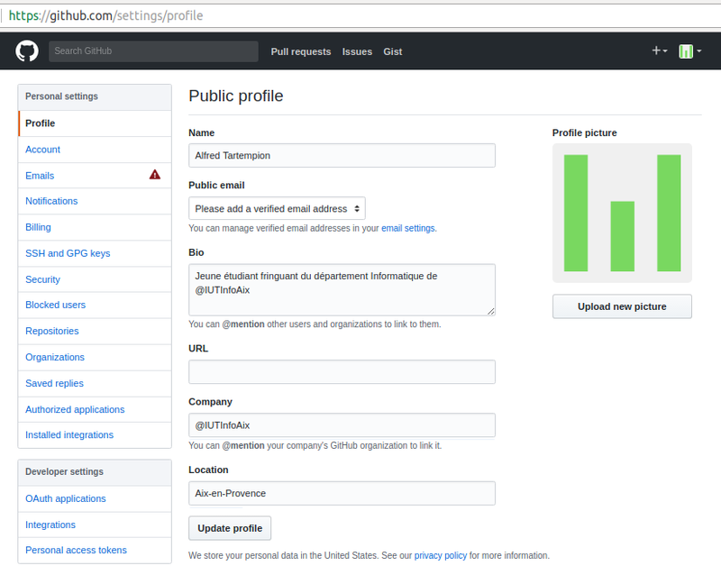

# Préparation de l'environnement

Comme vous allez le découvrir (a priori surtout l'approfondir), pour conserver vos réalisations et permettre à votre enseignant de suivre votre avancement vous allez apprendre à versionner votre travail sur [github](https://github.com/). Pendant ce module, vous allez principalement écrire du code pour vous-même. Comme vous le verrez plus tard ça sera principalement sur les SAÉ que [Git](https://git-scm.com/) offrira tout son potentiel.

## Création d'un compte Github

Rendez-vous sur la page d'accueil de [github](https://github.com/) :


Dans le coin supérieur droit cliquer sur "Sign Up". Dans la page qui apparaît, inscrivez votre nom d'utilisateur (**il doit être impérativement composé de votre prénom et de votre nom séparé par le caractère '-'**). 
Dans le champs "Email Adress" mettre votre adresse universitaire (important pour bénéficier des avantages liés à votre statut d'étudiant). 


Une fois le mot de passe renseigné cliquer sur le bouton "Create Account". Sur l'écran suivant, vous n'avez rien à changer et pouvez directement cliquer sur "Continue".


Le troisième et dernier écran d'enregistrement vous demande des informations sur votre profil. Indiquer principalement que vous êtes un étudiant et que vous comptez utiliser GitHub pour des projets étudiants.



Une fois ces informations renseignées vous pouvez cliquer sur "Submit" pour définitivement créer votre compte.


Ne pas oublier de valider votre adresse email en allant cliquer sur le lien reçu dans l'ENT.

## Paramétrage de votre compte GitHub

Maintenant que votre compte est créé, il faut personnaliser votre profil. GitHub, en plus de vous fournir un moyen simple et efficace de conserver votre code en ligne, est aussi un réseau social de développeur. Pour que votre profil puisse être valorisé un jour dans votre carrière pro, vous devez correctement renseigner vos informations (de manière annexe, ça facilitera la vie de vos enseignants quand ils essayent de savoir qui contribue vraiment dans les SAÉ).

Pour ce faire, cliquer en haut à droite de la fenêtre sur l’icône qui représente votre avatar par défaut et aller sur "Your profile"  :



Vous arrivez sur votre profil public (ce qui est visible quand on cherche votre nom) :


Cliquer sur le bouton "Edit profile" pour arriver sur le formulaire suivant :



Comme dans l'image précédente, renseignez correctement votre nom, prénom, votre localisation et éventuellement votre photo.

## Demande du "Student Pack"

Pour terminer la configuration de votre compte, il vous faut demander la remise académique vous permettant de bénéficier de dépôts privés et de nombreux autres avantages. Pour ce faire, il faut vous rendre sur la page suivante : https://education.github.com/pack


Cliquer sur le bouton "Get your pack" et certifiez que vous êtes bien un étudiant de plus de 13 ans : 


Vérifiez les informations vous concernant (Nom, Email et École principalement)


Validez le formulaire pour terminer cette demande. Généralement la validation de la demande intervient dans l'heure mais il peut arriver que ça puisse prendre plus de temps donc pas d'inquiétude.
 


## Configuration locale de Git

Pour commencer avec Git, nous utilisons directement la version en ligne de commande. Comme vous les verrez rapidement, il existe une  pléthore d'outils pour faciliter l'utilisation de Git mais pour s'en servir, il vaut mieux comprendre les commandes sous-jacentes.

La première chose à faire avant d'utiliser Git est de correctement le configurer. Cette étape en pratique peut prendre du temps mais nous allons simplifier la chose en téléchargeant deux fichiers : 

```sh
wget https://raw.githubusercontent.com/IUTInfoAix-M2105/git_config/master/gitconfig -O ~/.gitconfig
wget https://raw.githubusercontent.com/IUTInfoAix-M2105/git_config/master/githelpers -O ~/.githelpers
```

Ouvrez le fichier `~/.gitconfig` avec votre éditeur favori et renseignez votre nom, prénom et email dans la 
section `[user]`.
```
# Personnalisez les champs ci-dessous!
[user]
username = ChangeMe
name = Change Me
email = change-me@example.com

...

```
Les lignes précédentes doivent donc être modifiées de la sorte :

```
# Personnalisez les champs ci-dessous!
[user]
username = alfred-tartempion
name = Alfred Tartempion
email = alfred.tartempion@etu.univ-amu.fr

...

```

## Visualiser la branche courante

Histoire de visualiser plus facilement sur quelle branche vous êtes, si vous avez le malheur d'utiliser bash, modifiez votre prompt de votre terminal afin qu'il affiche la branche courante.

Éditez le fichier `~/.bash_profile` et ajoutez les lignes suivantes:

```sh
parse_git_dirty (){
  [[ $(git status 2> /dev/null | tail -n1) != "rien à valider, la copie de travail est propre" ]] && echo "*"
}

parse_git_branch () {
  git branch --no-color 2> /dev/null | sed -e '/^[^*]/d' -e "s/^..\(.*\)/(\1$(parse_git_dirty))/"
}

# Prompt simple pour afficher la branche git courante
PS1="\[\033[01;34m\]\w\[\033[00m\]" 
PS1="$PS1 \[\033[01;31m\]\$(parse_git_branch)\[\033[00m\]"
PS1="$PS1\$ "
```

Tapez `source ~/.bash_profile` pour charger la nouvelle configuration. Votre prompt devrait ressembler à cela:

```sh
~/helloworld (master)$
```

S'il y a des modifications pas encore versionnées, le nom de la branche courante sera suivi du caractère `*`.
